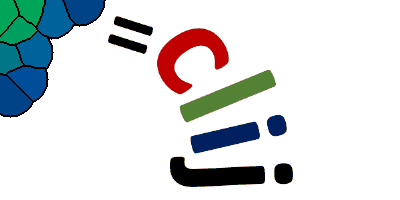

# CLIJ2: GPU-accelerated image processing for everyone

## Introduction
CLIJ2 is a GPU-accelerated image processing library for [ImageJ/Fiji](https://fiji.sc/), 
[Icy](http://icy.bioimageanalysis.org/), 
Matlab and Java. It comes with hundreds of operations for 
[filtering](https://clij.github.io/clij2-docs/reference__filter), 
[binarizing](https://clij.github.io/clij2-docs/reference__binary),
[labeling](https://clij.github.io/clij2-docs/reference__label),
[measuring](https://clij.github.io/clij2-docs/reference__measurement) in images,
[projections](https://clij.github.io/clij2-docs/reference__project),
[transformations](https://clij.github.io/clij2-docs/reference__transform) and 
[mathematical operations](https://clij.github.io/clij2-docs/reference__math) for images. 
While most of these are classical image processing operations, CLIJ2 also allows performing operations on 
[matrices](https://clij.github.io/clij2-docs/reference__matrix) potentially representing
[neighborhood relationships](https://clij.github.io/clij2-docs/reference__neighbor) between [cells](https://clij.github.io/clij2-docs/md/neighbors_of_neighbors) and pixels.

Under the hood it uses [OpenCL](https://www.khronos.org/opencl/) but users don't have to learn a new programming language such as OpenCL, they can just use it transparently. 
Entry-evel coding skills are sufficient! 
Increased efforts were put on documentation, code examples, user-convenience, interoperability, and extensibility.
CLIJ is based on 
[ClearCL](http://github.com/ClearControl/ClearCL), 
[JOCL](http://github.com/gpu/JOCL), 
[Imglib2](https://github.com/imglib), 
[ImageJ](http://imagej.net) and 
[SciJava](https://github.com/SciJava).

**CLIJ2 is build on CLIJ. If you use it, please cite it:**

Robert Haase, Loic Alain Royer, Peter Steinbach, Deborah Schmidt, 
Alexandr Dibrov, Uwe Schmidt, Martin Weigert, Nicola Maghelli, Pavel Tomancak, 
Florian Jug, Eugene W Myers. 
*CLIJ: GPU-accelerated image processing for everyone*. [Nat Methods 17, 5-6 (2020) doi:10.1038/s41592-019-0650-1](https://doi.org/10.1038/s41592-019-0650-1)

If you search for support, please open a thread on the [image.sc](https://image.sc) forum.

* Overview
  * [Quick tour](https://clij.github.io/clij2-docs/quick_tour)
  * [Introduction for ImageJ Macro users](https://clij.github.io/clij2-docs/macro_intro)
  * [Introduction for Java developers](https://clij.github.io/clij2-docs/api_intro)
  * Installation
    * [Fiji update site](https://clij.github.io/clij2-docs/installationInFiji)
    * [Icy](https://github.com/clij/clicy)
    * [Matlab](https://github.com/clij/clatlab)
    * [Maven/Java](https://github.com/clij/clij2-docs/dependingViaMaven)
  * [Cheat sheets](https://clij.github.io/clij2-docs/CLIJ2-cheatsheet_V3.pdf)
  * [Reference](https://clij.github.io/clij2-docs/reference)
  * [Release notes](https://github.com/clij/clij2/releases)
  * [Community guidelines](https://clij.github.io/clij2-docs/community_guidelines)
  * [Release cycle](https://clij.github.io/clij2-docs/release_cycle)    
  * [Future perspective: clEsperanto](http://clesperanto.net)
  
* Tutorials
  * [Basics](https://clij.github.io/clij2-docs/md/basics/)
  * [Combining CLIJ and CLIJ2](https://clij.github.io/clij2-docs/md/clij1_clij2_combination/)
  * Filtering and processing images
    * [Crop and paste images](https://clij.github.io/clij2-docs/md/crop_and_paste/)
    * [Gaussian blur](https://clij.github.io/clij2-docs/md/blur/)
    * [Maximum projections](https://clij.github.io/clij2-docs/md/maximumProjection/)
    * [Warp images](https://clij.github.io/clij2-docs/md/applyVectorFieldMD/)
    * [Drosophila embryo cell counting](https://clij.github.io/clij2-docs/md/drosophila_max_cylinder_projection/)

  * Segmentation and labelling
    * [Labeling](https://clij.github.io/clij2-docs/md/labeling/)
    * [Binary images](https://clij.github.io/clij2-docs/md/binary_processing/)
    * [Working with regions of interest (ROIs)](https://clij.github.io/clij2-docs/md/working_with_rois/)
    * [Voronoi diagrams](https://clij.github.io/clij2-docs/md/voronoi/)

  * Working with matrices and graphs
    * [Multiply vectors and matrices](https://clij.github.io/clij2-docs/md/multiply_vectors_matrices)
    * [Matrix multiplication](https://clij.github.io/clij2-docs/md/matrix_multiply/)
    * [Spots, pointlists, matrices and tables](https://clij.github.io/clij2-docs/md/spots_pointlists_matrices_tables/)
    * [Filtering in graphs](https://clij.github.io/clij2-docs/md/filtering_in_graphs/)
    * [Filtering between touching neighbors](https://clij.github.io/clij2-docs/md/mean_of_touching_neighbors)
    * [Neighbors of neighbors](https://clij.github.io/clij2-docs/md/neighbors_of_neighbors)
    * [Tribolium embryo morphometry](https://clij.github.io/clij2-docs/md/tribolium_morphometry/)
    * [Superpixel segmentation](https://clij.github.io/clij2-docs/md/superpixel_segmentation/)
    
  * Statistics and measurements
    * [Images statistics](https://clij.github.io/clij2-docs/md/image_statistics/)
    * [Pixel statistics on labelled images](https://clij.github.io/clij2-docs/md/measure_statistics/)
    * [Colocalisation measurements using Jaccard index and Sorensen/Dice coefficient](https://clij.github.io/clij2-docs/md/measure_overlap/)

  * Benchmarking
    * [Measure speedup](https://clij.github.io/clij2-docs/md/benchmarking/)
    * [Detailed time tracing](https://clij.github.io/clij2-docs/md/time_tracing/)
    * [Comparing and benchmarking workflows](https://clij.github.io/clij2-docs/md/compare_workflows/)
    * [Comparing image rotation ImageJ vs. CLIJ](https://clij.github.io/clij2-docs/md/rotate_comparison_IJ_CLIJ/)

* Media
  * [YouTube NEUBIAS Academy @home](https://youtu.be/uMj0OS1TiQE)
  * [NEUBIAS Symposium 2020, Bordeaux](https://git.mpi-cbg.de/rhaase/clij_neubias_2020)
  * [NEUBIAS Training School TS14, Bordeaux](https://git.mpi-cbg.de/rhaase/neubias_ts14)
  * [MTZ Image Processing Seminar, TU Dresden](https://git.mpi-cbg.de/rhaase/clij_mtz_2020)
  * [Quantitative BioImaging Conference 2020, Oxford](slides/2020-01-QBI_SmartMicroscopy_Haase_V2.pdf)
  * [NEUBIAS Training School TS13, Porto](https://git.mpi-cbg.de/rhaase/neubias_ts14)
     
* Example code
  * [ImageJ macro](https://github.com/clij/clij2-docs/tree/master/src/main/macro)
  * [Icy javascript](https://github.com/clij/clicy/tree/master/src/main/javascript)
  * [Icy protocols](https://github.com/clij/clicy/tree/master/src/main/protocols)
  * [Matlab](https://github.com/clij/clatlab/tree/master/src/main/matlab)
  * [Java](https://github.com/clij/clij2-docs/tree/master/src/main/java/net/haesleinhuepf/cli2/examples)
  * [ImageJ Beanshell](https://github.com/clij/clij2-docs/tree/master/src/main/beanshell)
  * [ImageJ Groovy](https://github.com/clij/clij2-docs/tree/master/src/main/groovy)
  * [ImageJ Javascript](https://github.com/clij/clij2-docs/tree/master/src/main/javascript)
  * [ImageJ Jython](https://github.com/clij/clij2-docs/tree/master/src/main/jython)    
  
* Development
  * [CLIJ2 development](https://clij.github.io/clij2-docs/development)
  * [CLIJ2 plugin template](https://github.com/clij/clij2-plugin-template)

* FAQ / support
  * [Frequently asked questions](https://clij.github.io/clij2-docs/faq)
  * CLIJ versus CLIJ2
    * [CLIJ documentation (archived)](https://github.com/clij/clij-docs)
    * [CLIJ BioRxiv preprint (archived)](https://doi.org/10.1101/660704)
    * [What's different between CLIJ1, CLIJ2 and CLIJx?](https://clij.github.io/clij2-docs/clij12xAPIcomparison)
    * [CLIJ - CLIJ2 transition guide (under construction)](clij2_transition_notes)
  * [Troubleshooting](https://clij.github.io/clij2-docs/troubleshooting)
  * [Support](https://image.sc)
  * [Imprint](https://clij.github.io/imprint)

## Acknowledgements
Development of CLIJ is a community effort. We would like to thank everybody who helped developing and testing. In particular thanks goes to
Alex Herbert (University of Sussex),
Bertrand Vernay (IGBMC, Strasbourg)
Bram van den Broek (Netherlands Cancer Institute),
Brenton Cavanagh (RCSI),
Brian Northan (True North Intelligent Algorithms),
Bruno C. Vellutini (MPI CBG),
Curtis Rueden (UW-Madison LOCI),
Damir Krunic (DKFZ),
Daniela Vorkel (MPI CBG),
Daniel J. White (GE),
Eduardo Conde-Sousa (University of Porto),
Erick Ratamero (The Jackson Laboratory),
Gaby G. Martins (IGC),
Guillaume Witz (Bern University),
Giovanni Cardone (MPI Biochem),
Jan Brocher (Biovoxxel), 
Jean-Yves Tinevez (Institute Pasteur),
Johannes Girstmair (MPI CBG),
Juergen Gluch (Fraunhofer IKTS),
Kota Miura,
Laurent Thomas (Acquifer), 
Matthew Foley (University of Sydney),
Matthias Arzt (MPI-CBG),
Nico Stuurman (UCSF),
Nik Cordes (Los Alamos National Laboratory),
Ofra Golani (Weizmann Institute of Science),
Peter Haub,
Pete Bankhead (University of Edinburgh),
Pit Kludig,
Pradeep Rajasekhar (Monash University),
Rita Fernandes (University of Porto),
Ruth Whelan-Jeans,
Si&acirc;n Culley (LMCB MRC),
Tanner Fadero (UNC-Chapel Hill),
Thomas Irmer (Zeiss),
Tobias Pietzsch (MPI-CBG),
Wilson Adams (VU Biophotonics)

R.H. was supported by the German Federal Ministry of
Research and Education (BMBF) under the code 031L0044
(Sysbio II) and D.S. received support from the German
Research Foundation (DFG) under the code JU3110/1-1.
P.T. was supported by the European Regional
Development Fund in the IT4Innovations national
supercomputing center-path to exascale project,
project number CZ.02.1.01/0.0/0.0/16_013/0001791
within the Operational Programme Research, Development
and Education.

[Imprint](https://clij.github.io/imprint)
  

